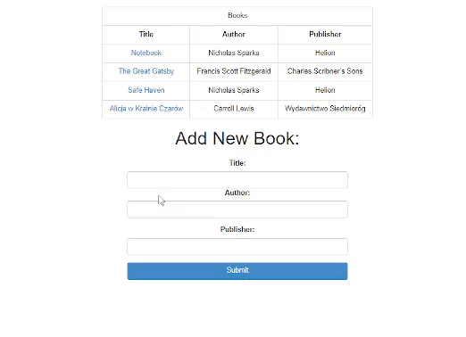

# Backend app for list of books

## Table of contents
* [Description](#description)
* [Overview](#overview)
* [Demo](#demo)
* [Technologies](#technologies)

## Description

REST - API application which is written in Java.

 
What you can do:

<ul>
  <li>
    <strong>Add new tasks</strong>
    
You can add new books and they will be displayed above.

  </li>
  <li>
    <strong>Update book</strong>
    
You can update your book if, for example, you make a typo.

  </li>
  <li>
    <strong>Remove book</strong>
    
You can delete the book if you think it is unnecessary.

  </li>
</ul>

## Overview

## Demo

You can find the demo [here](https://palarczykenterprises.com/books/)

## Technologies

Project is created with:

* Java
* Spring Boot
* Spring Data JPA
* Spring Data JDBC
* Hibernate
